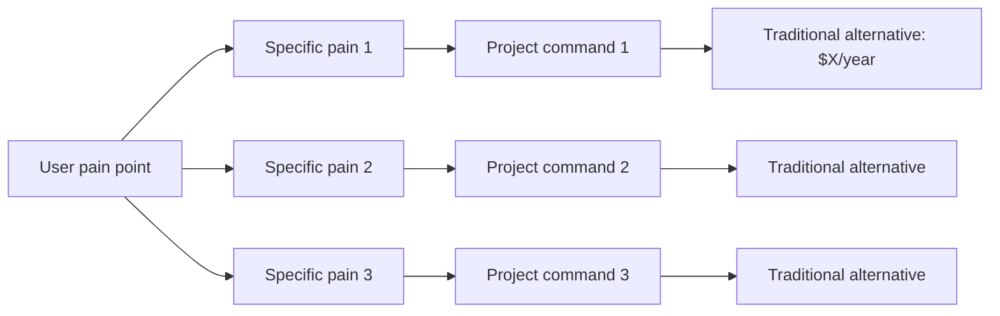
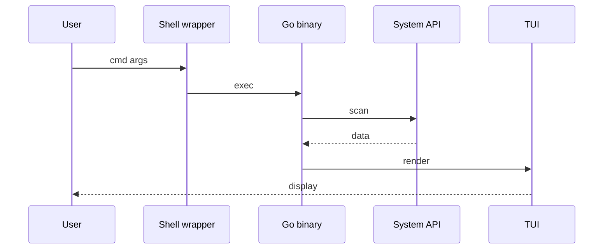

# Markdown Technical Deep-Dive (Mode B Template)

Reference for Mode B output — Obsidian-flavored Markdown deep-dives written for engineers studying a project's architecture.

**Companion example**: `mac清理工具 mole分析.md` in the user's vault (analyzing [tw93/Mole](https://github.com/tw93/Mole)) is the canonical demonstration. Read it before writing a new one.

---

## 1. YAML Frontmatter Template

Every Mode B file starts with frontmatter. Obsidian reads it for metadata, graph view, and search. Keep keys consistent across notes so the user's vault stays queryable.

```yaml
---
title: <Project> 项目深度分析 — <one-liner about what it does>
repo: https://github.com/owner/name
homepage: <optional>
stars: <number from `gh repo view`>
forks: <number>
created: YYYY-MM-DD
latest: <tag name> (YYYY-MM-DD)
license: <MIT / Apache-2.0 / ...>
maintainer: <github handle or org> (个人开发者 / 公司团队 / 社区)
language: <primary> (XX%) + <secondary> (YY%)
tags:
  - <category like cli / web / ai / mobile>
  - <technology like rust / shell / go>
  - <topic like cleanup / monitoring / agent>
  - 开发笔记   # standard tag — user's vault convention
created_at: YYYY-MM-DD   # the day this analysis was written
---
```

**Notes**:
- All values from `gh repo view <repo> --json name,description,stargazerCount,forkCount,createdAt,pushedAt,latestRelease,licenseInfo,primaryLanguage,languages` — don't fabricate
- `tags` are flat (Obsidian style); use lowercase + hyphens; include `开发笔记` if the user's vault has this convention
- `language` ratio: compute from the `languages` API response (bytes per language)

---

## 2. Obsidian Callout Syntax

Use callouts to break up dense prose. Don't overuse — 4-8 per document max.

```markdown
> [!info] 一句话总结
> Single-sentence positioning statement at the top of the doc.

> [!tip] 商业定位
> Reusable insight that you want the reader to remember.

> [!note] 模块化策略
> Side observation about a design choice.

> [!warning] 安全设计的精髓
> Cautionary point. The project's limits or risks.

> [!danger] 破坏性操作
> (rare) Reserve for actual hazard warnings.

> [!example] 实战命令
> Code samples or worked examples.

> [!quote] README 原话
> Direct citation from the project's docs.

> [!abstract] 一句话总结
> The 1-sentence TL;DR at the very end of the document.
```

**Convention for this skill**:
- Open with `> [!info]` — the project's positioning
- Close with `> [!abstract]` or final `> [!tip]` — the takeaway
- Use `> [!warning]` for safety / boundary observations
- Use `> [!note]` for design choices worth highlighting

---

## 3. Mermaid Diagram Patterns

Obsidian renders Mermaid in fenced ` ```mermaid ` blocks. Two patterns work well in deep-dives:

### Pattern A: Problem → Solution mapping (Section "What it solves")



### Pattern B: Architecture ASCII (fenced code block, NOT Mermaid)

For Shell + Go style hybrid architectures or process-pipeline diagrams, ASCII box-and-arrow is often clearer than Mermaid:

```
┌─────────────────────────────────┐
│      User input: cmd flag       │
└─────────────┬───────────────────┘
              ↓
┌─────────────────────────────────┐
│  Entry script (Bash, 9 lines)   │
│       exec ./main "$@"          │
└─────────────┬───────────────────┘
              ↓
   ┌──────────┴──────────┐
   ↓                     ↓
┌────────┐         ┌────────────┐
│ Pure   │         │ Shell+Go   │
│ Shell  │         │ wrapper    │
└────────┘         └────────────┘
```

ASCII works because it doesn't require Mermaid's specific syntax and copy-pastes well into other tools.

### Pattern C: Sequence flow (Mermaid for multi-actor interactions)



Use sparingly — only when there are 3+ actors and ordering matters.

---

## 4. Section-by-Section Template

### H1: Title

```markdown
# <Project> 项目深度分析
```

Same as `title` in frontmatter without the trailing dash phrase.

### Lead callout (immediately after H1)

```markdown
> [!info] 一句话
> <Project> 是 <person/team> 用 **<tech stack>** 做的 <what it is>，**<X months, Y stars>**，<the killer claim — what makes it interesting>。
```

### TL;DR

4-6 bullets. Each bullet is **one substantive observation** about the project, not a generic feature list.

```markdown
## TL;DR

1. **产品定位**：<who's it for, what does it replace>
2. **技术决策**：<the most interesting architectural choice — borrow-worthy>
3. **<another dimension>**：<...>
4. **分发策略**：<install method, release cadence>
5. **生态 / 商业**：<if applicable — pricing, community, etc.>
```

### Quick Facts table

```markdown
## 1. 基本信息速览

| 维度 | 数据 |
|---|---|
| **创建时间** | YYYY-MM-DD (about X months ago) |
| **当前版本** | <tag> (released YYYY-MM-DD) |
| **Stars / Forks** | XX,XXX / X,XXX |
| **主语言比例** | <primary> XX% · <secondary> YY% |
| **License** | MIT / Apache-2.0 / ... |
| **作者** | <handle> (individual / company / community) |
| **Homepage** | <if any> |
| **安装方式** | <one or two main methods> |
```

### Problem solved (with Mermaid)

```markdown
## 2. 它解决什么问题

[Mermaid diagram: Pattern A]

> [!tip] <The positioning insight>
> <Why this project's framing matters in the market>
```

### Core technical decision

The heart of the document. Pick the ONE architectural choice the project is most distinctive for, and explain it deeply.

```markdown
## 3. 核心技术决策：<headline phrase>

### 3.1 Why not <alternative A>?
- ❌ Concrete tradeoff 1
- ❌ Concrete tradeoff 2

### 3.2 Why not <alternative B>?
- ❌ Concrete tradeoff 1
- ❌ Concrete tradeoff 2

### 3.3 The project's choice: <name the pattern>

[ASCII diagram showing the architecture]

**Division of responsibility**:
- **<Component A> handles**: ...
- **<Component B> handles**: ...

### 3.4 Smart details

1. **<Specific decision name>**: why it matters
2. **<Specific decision name>**: why it matters
3. ...
```

### Code map

Show the directory structure, but **annotated**. A bare `tree` output is useless; what's useful is "this directory does X, that file is the entry point".

```markdown
## 4. 代码地图

### 4.1 顶层结构

​```
Project/
├── entry-point          # 9 lines, dispatches to main
├── main                 # ~3000 lines, command router
├── install.sh           # bootstrap script
├── Makefile             # build orchestration
├── go.mod / go.sum      # Go deps
│
├── lib/                 # Shell library (by responsibility)
│   ├── core/            # logging, sudo, path validation, UI helpers
│   ├── clean/           # cache cleaners (per resource type)
│   └── ...
├── cmd/                 # Go source
│   ├── analyze/         # disk scanner + Bubble Tea TUI
│   └── status/          # live system metrics TUI
└── tests/               # E2E + integration tests
​```

### 4.2 <key subdirectory> deep look

| File | Responsibility |
|---|---|
| `caches.sh` | system cache dispatch |
| `dev.sh` | Xcode / npm / pip / cargo cleanup |
| ... | ... |
```

### Key technical paths (the crown jewel of Mode B)

Pick 2-4 important commands or features. For each, trace the path from user input → exit. Be specific: file paths, function names, what each step does.

```markdown
## 5. 关键命令的技术路径深度拆解

### 5.1 `cmd action` — short description

​```
cmd action
  ↓ entry script
  ↓ exec main action
  ↓ main: load lib/core/*.sh
  ↓ dispatch to bin/action.sh
  ↓
  bin/action.sh
    ├── source lib/X/Y.sh
    │     ├── step 1
    │     ├── step 2
    │     └── step 3 (with key detail)
    ├── source lib/X/Z.sh
    │     └── ...
    └── summary
​```

**关键技术点**:
- **<technical pattern>**: <why this matters>
- **<technical pattern>**: <why this matters>
- **<edge case handling>**: <why this matters>

### 5.2 `cmd analyze` — Shell → Go transition

[same flow tree, showing where Shell exits and Go takes over]

### 5.3, 5.4 — more commands as needed
```

### Safety / boundary design (if applicable)

Skip if the project doesn't do destructive operations. Include if it touches user data, network, or system state.

```markdown
## 6. 安全 / 边界设计

### 6.1 <safety mechanism>

<how it works>

### 6.2 <safety mechanism>

<how it works>

...

> [!warning] 安全设计的精髓
> <The meta-lesson — what's the project's safety philosophy>
```

### Build & distribution

```markdown
## 7. 构建与分发

### 7.1 Makefile / build system

​```makefile
# key targets
​```

### 7.2 Install script flow

[step-by-step]

### 7.3 Release strategy

<single vs multi-arch, CDN vs Releases, fallback chain>

### 7.4 Business model (if relevant)

<commercial GUI / paid tier / sponsorship>
```

### Dependency analysis

For each major dependency, answer: **what is it**, **why was it chosen**, **what's the alternative**, **what's the tradeoff**.

```markdown
## 8. 依赖技术栈剖析

### 8.1 `github.com/foo/bar` (purpose)

- **What it is**: short description
- **Why it was picked**: vs alternative X / Y
- **Tradeoffs / limits**: what it doesn't do
- **Where used**: `cmd/.../file.go`

### 8.2, 8.3, ... — each major dep
```

### Lessons to borrow

The "so what" section — what can the reader steal for their own projects? 5-10 patterns, mix of ✅ (do this) and ⚠️ (watch out for this).

```markdown
## 9. 可借鉴的设计模式

> 这部分是给自己看的：哪些做法以后写类似项目可以抄。

### 9.1 ✅ <Pattern name>

<When it applies, when it doesn't>

### 9.2 ✅ <Pattern name>

<...>

...

### 9.X ⚠️ <Caution>

<A limit or downside the reader should know about>
```

### References

```markdown
## 10. 参考链接

- **Repo**: https://github.com/...
- **Homepage**: ...
- **Author**: ...
- **Latest release**: ...
- **Key dependencies**: ...
```

### Final takeaway

```markdown
## 11. 一句话总结

> **<Project> 的成功不在于 X，而在于 Y**：<the meta-takeaway>。<who should read the source code>。
```

---

## 5. How to Save the File

### Parsing Obsidian URLs

If the user provides `obsidian://open?vault=<vault>&file=<path>`:

1. URL-decode `vault` and `file`
2. Find vault root on disk:

```bash
find ~/Documents ~/Library ~/Downloads ~/本地文稿 ~ -maxdepth 4 -type d -name "<vault>" 2>/dev/null | head -1
```

3. Full path = `<vault root>/<decoded file path>.md` (add `.md` if missing)
4. Verify parent directory exists with `ls "$(dirname <path>)"` — if missing, ask user (don't create directories without confirmation)

### Worked example

Input:
```
obsidian://open?vault=Obsidian%20Vault&file=tobe%2F1-%E8%BE%93%E5%85%A5%E5%8C%BA%2F%E5%AE%9E%E8%B7%B5%E7%AC%94%E8%AE%B0%2F%E5%BC%80%E5%8F%91%E7%AC%94%E8%AE%B0%2Fmac%E6%B8%85%E7%90%86%E5%B7%A5%E5%85%B7%20mole%E5%88%86%E6%9E%90
```

Decoded:
- vault: `Obsidian Vault`
- file: `tobe/1-输入区/实践笔记/开发笔记/mac清理工具 mole分析`

Disk lookup → `/Users/<user>/本地文稿/Obsidian Vault/`
Final path → `/Users/<user>/本地文稿/Obsidian Vault/tobe/1-输入区/实践笔记/开发笔记/mac清理工具 mole分析.md`

### After writing

Verify with `wc -l "<path>"` to confirm the file was written and isn't empty.

---

## 6. Tone Calibration

### Audience profile

- Engineer with 3+ years experience
- Already read the project's README
- Wants the next layer down: design decisions, code patterns, tradeoffs
- Reading this as research for their own work

### Voice

- Direct, opinionated, peer-to-peer
- "聪明的设计" / "踩坑的地方" / "为什么不这样" are fair framings
- Have a position: which choices are smart, which are debatable, which are limits

### Allowed jargon (no need to explain)

In Mode B, these can appear without inline definition:
- TUI / CLI / REPL
- OAuth / OIDC / API / endpoint
- async / mutex / semaphore / channel / goroutine
- HashMap / B-tree / heap / queue
- gRPC / REST / GraphQL / WebSocket
- Docker / k8s / namespace
- LLM / token / context window (in AI projects)
- singleflight / debounce / throttle

### Still requires explanation

- Project-invented terms ("Skill", "Bundle Resolver", "operation log" — explain first appearance)
- Unusual algorithm names ("singleflight" is fine but newer/rarer terms get a sentence)
- macOS / Windows / Linux-specific concepts when relevant ("launch agent" vs "systemd unit")

### Banned (same as Mode A)

- Marketing hype ("revolutionary", "game-changing", "blazingly fast")
- Excessive emojis in body text (✅ ❌ ⚠️ in headers are fine)
- Dishonest token accounting (Principle 6a still applies — "zero token cost" claims are wrong)
- False capability claims (Principle 6 still applies — don't say AI "can't" do something it can)

---

## 7. Quality checks before delivery

Run mentally before saving:

1. **Frontmatter valid YAML?** All values present, no syntax errors
2. **TL;DR genuinely brief?** 4-6 bullets, not a paragraph or 12 items
3. **Core technical decision section has the "why not alternatives" reasoning?** Not just descriptive
4. **At least one Mermaid or ASCII diagram?** Usually problem-solution map or architecture
5. **At least 2 commands traced end-to-end?** With file paths and step-by-step
6. **Dependency analysis answers "why this dep, not X"?** Not just a list of links
7. **可借鉴 has at least 5 patterns + at least one ⚠️ caution?** A pure cheerleader doc is worthless
8. **References URLs work?** Spot-check 2-3
9. **Saved to user's exact path?** `wc -l` confirms file isn't 0 bytes
10. **Plain-Language Pass relaxed but Token Honesty (6a) enforced?** No "zero token" claims even in technical context

If any check fails, fix before declaring done.
